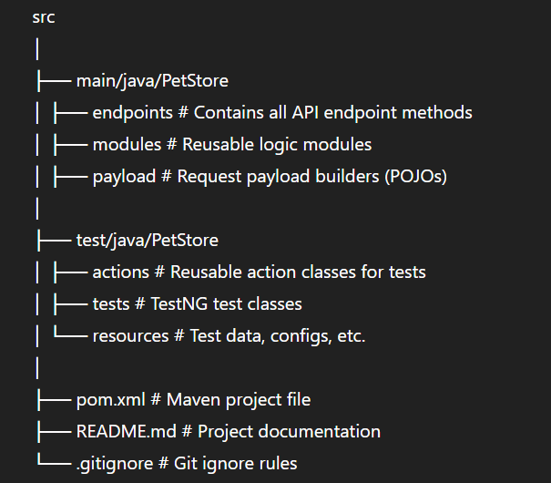

# 🐾 Pet Store API Automation Framework

An end-to-end **API Automation Testing Framework** built using **RestAssured**, **Java**, and **TestNG**, designed to perform CRUD operations on the Pet Store API. The framework follows the **Page Object Model (POM)** design pattern to ensure maintainability and scalability.

---

## 🚀 Tech Stack

| Tool     | Description                                  |
|----------|----------------------------------------------|
| Java     | Programming language                         |
| RestAssured | API Testing Library                          |
| TestNG   | Testing Framework                            |
| Maven    | Build & Dependency Management                |
| AssertJ  | Fluent Assertion Library                     |
| Jackson  | JSON Serialization/Deserialization        |
| Jenkins  | CI/CD Integration                            |

---

## 📁 Project Structure

---

## ✅ Features

- CRUD operations testing on Pet Store API
- Modular, scalable POM-based framework
- Custom assertions with AssertJ
- JSON parsing with Jackson and GSON
- CI/CD ready with Jenkins integration
- Clear test logs and Allure reporting (optional)

---

